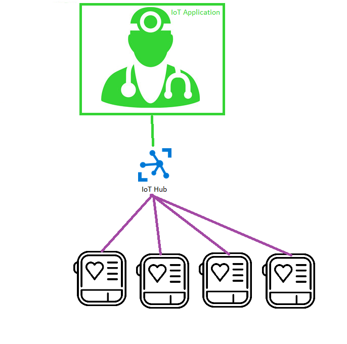
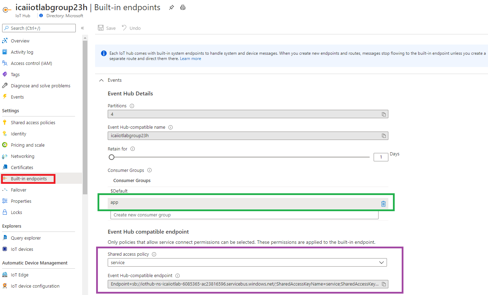
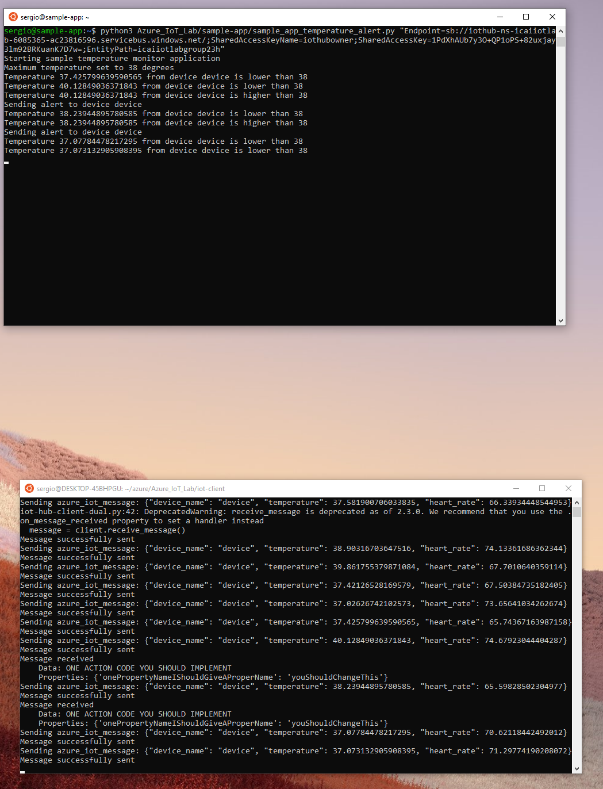
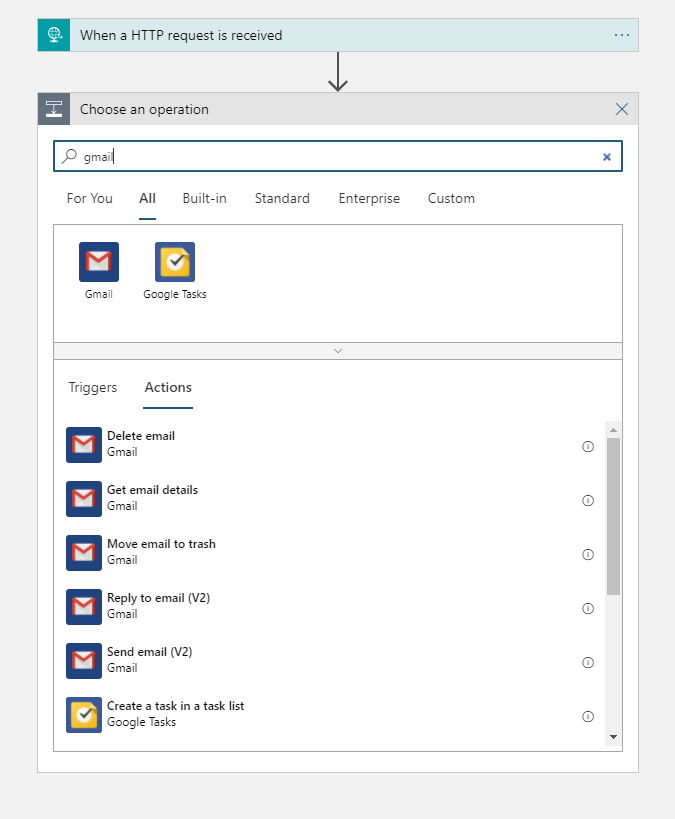
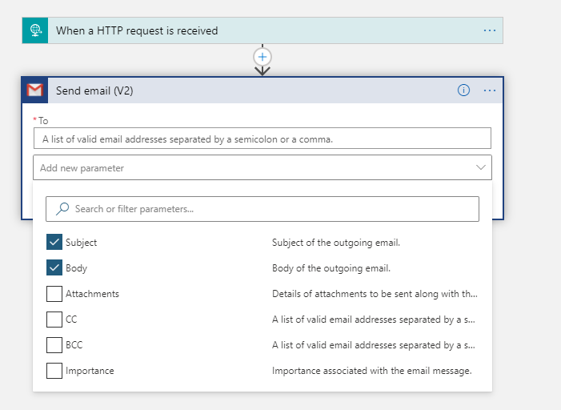
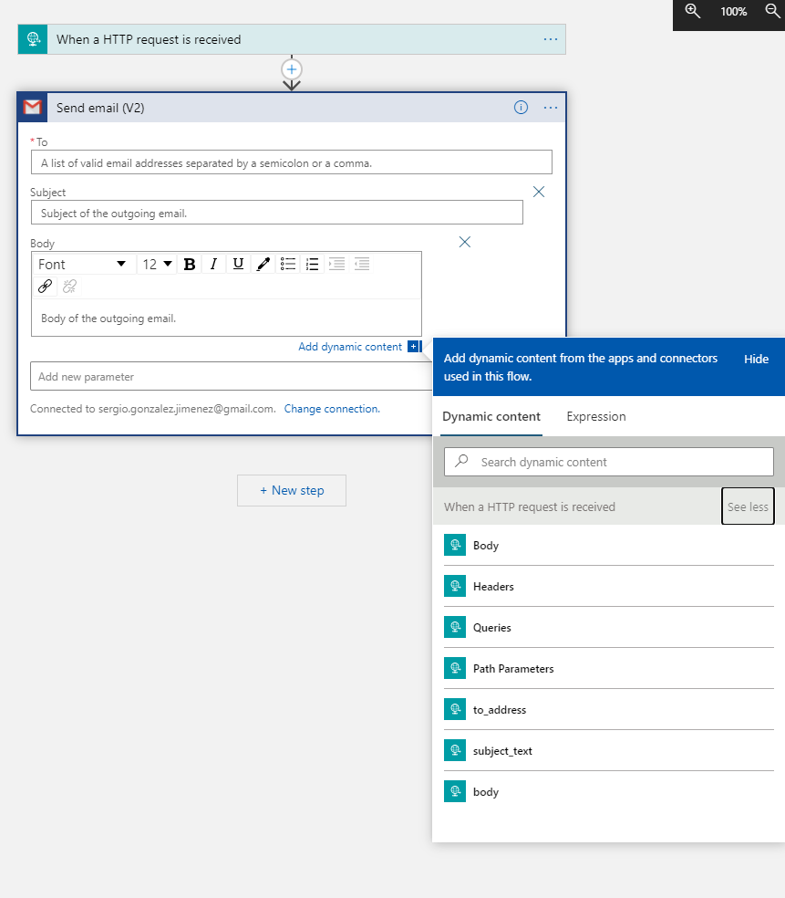
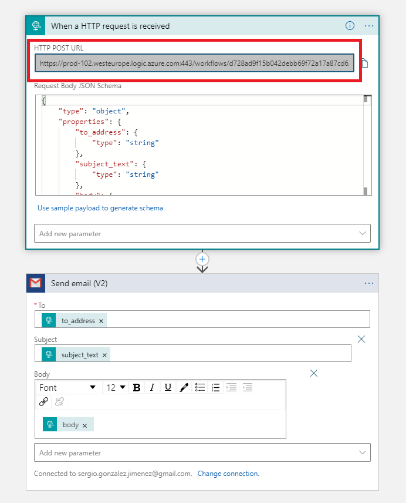

# Creating IoT applications

So far, we have seen different modules that highlight IoT application concepts for creating real IoT projects. This module will show a simple IoT application leveraging the concepts practiced so far in all previous modules.
We are going to build an application that gets health data from many devices and controls the monitored body temperature. 
For this module, we will focus on a single device, but the APP will scale to a large number of connecting devices, as depicted in the following image:



### Creating an IoT application that receive and sends messages to devices

For this, create a new sample VM as you did in module 2, but for playing the role of a simulated sensor in that case. Use the following command for installing the required packages in this new APP VM:

```sh
sudo apt-get update -y
sudo apt install python3-pip -y
pip3 install azure-iot-device
pip3 install azure-iot-hub
pip3 install azure-eventhub
git clone https://github.com/microsoft/iot-curriculum.git

cd iot-curriculum/labs/iot/hands-on-with-azure-iot-hub
```

In order to run the APP you need the IoT Hub built-in endpoint connection string. You can obtain it in the following window:
As highlighted in green, you need to create a consumer group for the APP, otherwise, it will conflict with other readers such as Azure Time Series Insights implemented in the previous module.
As highlighted in purple, select the **Shared access policy** type **service**

```sh
python3 sample-app/sample_app_temperature_alert.py "Endpoint=sb://iothub-ns-icaiiotlab-12345-ac23816596.servicebus.windows.net/;SharedAccessKeyName=service;SharedAccessKey=11232323232323232323;EntityPath=icaiiotlabgroup23h"
```



See in the capture below, you have a simulated device at the bottom as you did in lab 2 being controlled by an application:



The script for simulating a device that sends and receive messages is located [here](../iot-client/iot-hub-client-dual.py)

The script for simulating an application that send a message above a given temperature is located [here](../sample-app/sample_app_temperature_alert.py)

### Integrating the APP with Azure Logic Apps (ALA) for executing ALA workflows

Azure Logic Apps, used in module 6, is a highly versatile service that can be used for implemented complex workflows. It has many connectors with 3rd party applications (Twitter, Office365, Gmail, custom webhooks, Microsoft Teams, Slack) allowing you create cool interactions. Please take a look at the Microsoft [Azure official documentation](https://docs.microsoft.com/azure/logic-apps/?WT.mc_id=academic-7372-jabenn) and many available examples in the internet.

In the following example, we will implement an application that sends emails to users.
We will trigger the application sending the following self explanatory parameters:

* to_address
* subject
* body

For initial steps, please create an Azure Logic App, reviewing steps 1 to 6 in module 7.
In step 7, for this very example, input the following sample content:
Copy and paste the following sample JSON.

```json
 {
        "to_address": "pepe.perez@gmail.com",
        "subject_text": "testing email",
        "body": "hello"
 }
```

Once input, we will select the subsequent operation. In this example, sending an email using the GMAIL connector with the **Send email (V2)** task.



Once the connector is configured, we need to select email parameters. In this example, we will use the **Subject** and the **Body** content, as defined in the API definition with the sample content input.



Logic Apps creates some fields called **dynamic content** based on the input parameters in the API call definition you did in the previous block. Select the parameters **to_address**, **subject_text** and **body** and place them in the proper location.



Once configured, select **Save** and copy the API URL as described below highlighted in red.



Update the parameter **api_endpoint** in the [script provided](../sample-app/logic_app_launcher.py)

Good luck, have fun, your creativity is the limit and do epic stuff!!
